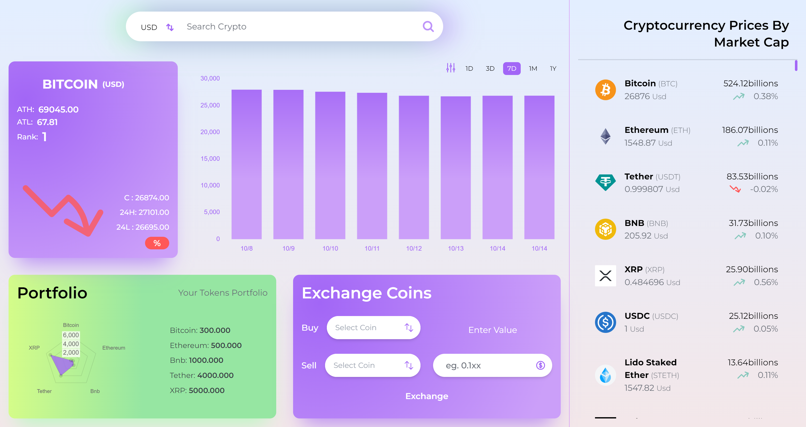

# Cryptocurrency Dashboard

## Welcome! 👋

## Cryptocurrency Dashboard Web Application

## Links

- Github URL: [Github](https://github.com/Amitk2108/CryptocurrencyDashboard)
- Live Site URL: [Live](https://currencydashb.netlify.app/)

## Overview

### The Project

A Cryptocurrency Dashboard app built with react js and tailwind css where a user can

- Monitor Cryptocurrency Currencies
- Select a coin and see chart for the same with some additional information like current price, high, low and ranking of the coin in Cryptocurrency market depending on the marketcap
- Portfolio section where user can see how much fund available in account wallet
- Exchange coin between different cryptocurrencies
- Select chart between Line and bar chart

### Built with

- [React](https://reactjs.org/) - JS library
- [Tailwind Css](https://tailwindcss.com/) - For Css
- [Redux Toolkit](https://redux-toolkit.js.org/) - For State Management
- [Chartjs](https://www.chartjs.org/) - For Chart Componenets in App
- [Headless ui](https://headlessui.com/) - For modals and dropDown menu components
- [CoinGecko API](https://www.coingecko.com/en/api/documentation) - For Api data

### Continued development

Working on feature like comparing different coin

## Author

- Website - [Amit](https://amitpro.netlify.app/)
- LinkedIn - [@amit-ib](https://www.linkedin.com/in/amit-ib/)
